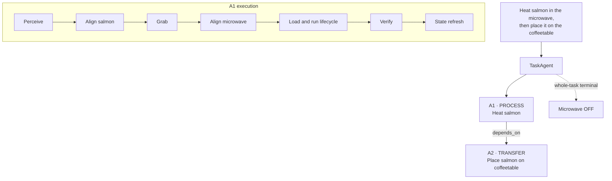

# HPAF

## Hierarchical Program-Aided Framework for Long-Horizon Robot Task Execution

HPAF studies long-horizon robot task execution with LLM-generated programs. Instead of generating one monolithic program for the whole instruction, HPAF explicitly decomposes a complex instruction into independently verifiable semantic atomic tasks and executes them against refreshed environment state.

The repository contains the frozen VirtualHome evaluation, its complete audit trail, and a separate PiPER/RGB-D engineering prototype. The reported VirtualHome results evaluate symbolic task planning and execution; they are not real-robot evaluation results.

## Motivation

One-shot whole-program generation becomes increasingly fragile when an instruction contains multiple semantic checkpoints and causal dependencies. Typical failures include:

- semantic goal omission;
- reasoning from stale state;
- spatial alignment or action-precondition failure;
- propagation of an early error through the remainder of a long program; and
- incomplete process lifecycles, such as starting an appliance without completing the requested process.

HPAF introduces explicit semantic execution boundaries. Each boundary creates a point at which the system can ground against current state, execute a bounded stage, verify its semantic commitment, and localize one repair before proceeding.

## Method

HPAF is a two-layer framework.

### Layer 1: semantic task decomposition

The TaskAgent maps a natural-language instruction to a **Structured Semantic Atomic Task IR**. One atomic task is one dominant, independently verifiable semantic commitment—not a primitive action and not a fixed number of primitives.

Each atomic record contains:

- an atomic type;
- one focal object;
- optional source and target objects;
- a state or process completion mode;
- a semantic goal; and
- explicit `depends_on` edges.

The frozen atomic types are:

- `TRANSFER`
- `STATE_CHANGE`
- `PROCESS`
- `MULTI_OBJECT_COUPLED`
- `INTERACTION`

The semantic boundary determines **where** the instruction is split; the atomic type describes **what the resulting atomic means**. A process atomic may therefore contain loading, activation, and lifecycle completion, while navigation and manipulation primitives remain internal to that atomic.

Task-level terminal constraints are represented separately. They describe states that must hold when the whole instruction finishes, but they are not automatically promoted into standalone atomic tasks.

### Dependency-aware execution

`depends_on` forms a DAG of genuine causal precedence rather than forcing the total order of a reference program. The executor selects a ready atomic in stable topological order and marks it complete only after online verification.

```text
A1 PROCESS: Heat salmon
        |
        v
A2 TRANSFER: Place salmon on table

Terminal constraint: microwave OFF
```

The terminal constraint belongs to whole-task completion. It does not imply a separate “switch off microwave” atomic.

### Layer 2: current-state atomic execution

Each ready atomic executes as:

```text
P -> (A -> I)^k -> V
```

- **P — Perception/current-state grounding:** obtain fresh local symbolic state.
- **A — Alignment:** establish the spatial and primitive preconditions for the next interaction.
- **I — Interaction:** execute the state-changing primitive operation.
- **V — Verification:** judge the current semantic atomic from current observation and its attempt trace.

An atomic may contain several alignment–interaction pairs because its source and target are often different. After successful verification, HPAF refreshes state before generating the next ready atomic. If verification returns `done=false`, the frozen method permits at most one localized repair (**Retry-1**); a second failure stops execution.

The complete frozen definition is in [`HPAF_METHOD_FINAL.md`](experiments/progprompt_vh/phase10/HPAF_METHOD_FINAL.md).

### Example



The successor transfer is generated only after the process atomic verifies and the environment state has been refreshed.

## Compared methods

- **ProgPrompt-Compat:** released three-example whole-program generation with assertions and adjacent local recovery; no full replanning.
- **HPAF-Flat:** one whole-task ProgramAgent followed by whole-task verification. It has no TaskAgent, structured atomic IR, dependency DAG, per-atomic Retry-1, or access to Full's decomposition.
- **HPAF-Full:** structured semantic decomposition, dependency-aware ready-node execution, current-state per-atomic generation, atomic verification, terminal handling, state refresh, and Retry-1.

The Full-versus-Flat comparison is a comparison between these two frozen systems. It does **not** isolate decomposition alone, because Full also adds dependency scheduling, state refresh, atomic verification, terminal handling, and localized repair.

## Evaluation

### VH-40 Unified Regression Matrix

The primary public result is the Phase-10R **VH-40 Unified Regression Matrix**. VH-40 is a regression suite, not an unseen test set. It contains:

- 29 official-source evaluable regression instances; and
- 11 pre-frozen causal long-horizon extensions.

All 40 tasks had been observed during earlier development or failure analysis. Phase-10R reran exactly `40 tasks × 3 methods × 1 run = 120` unique task–method records under one frozen method, evaluator, backend, and runtime identity.

| Method | VH-40 Task SR | Long-15 SR | Macro Exec | Calls/task | Tokens/task |
|---|---:|---:|---:|---:|---:|
| ProgPrompt-Compat | 22/40 (55.0%) | 2/15 (13.3%) | 0.956 | 11.32 | 6812.9 |
| HPAF-Flat | 26/40 (65.0%) | 11/15 (73.3%) | 0.817 | 2.00 | 2716.2 |
| HPAF-Full | 32/40 (80.0%) | 12/15 (80.0%) | 0.951 | 4.45 | 5940.9 |

HPAF-Full completed 32/40 tasks in the unified regression matrix and 12/15 Long tasks, while using 60.7% fewer LLM calls and approximately 12.8% fewer tokens per task than ProgPrompt-Compat.

The result supports a frozen-version regression comparison, not an unseen-generalization claim. See the [final report](experiments/progprompt_vh/phase10_regression/PHASE10R_FINAL_REPORT.md), [unified CSV](experiments/progprompt_vh/phase10_regression/results/VH40_UNIFIED_REGRESSION.csv), [integrity audit](experiments/progprompt_vh/phase10_regression/INTEGRITY_AUDIT.md), and [formal records](experiments/progprompt_vh/phase10_regression/results/formal/PHASE10R_FORMAL_RECORDS.jsonl).

### Independent causal holdout

Phase 10 separately evaluated a single pre-frozen synthetic causal holdout with one run per pair:

| Method | Success/12 |
|---|---:|
| ProgPrompt-Compat | 0/12 |
| HPAF-Flat | 6/12 |
| HPAF-Full | 10/12 |

This 12-task holdout remains separate independent validation evidence. It is not pooled with VH-40. See the [Phase-10 report](experiments/progprompt_vh/phase10/PHASE10_FINAL_REPORT.md).

## Repository structure

```text
hpaf/
├── hpaf/                         # PiPER/RGB-D engineering prototype package
├── configs/                      # Robot, perception, LLM, and API configuration
├── scripts/                      # Real-system entry points and utilities
├── experiments/
│   └── progprompt_vh/
│       ├── phase10/              # Frozen method and independent 12-task holdout
│       └── phase10_regression/   # Final VH-40 regression, records, and audits
├── third_party/
│   ├── progprompt-vh/            # Pinned upstream submodule
│   └── virtualhome/              # Pinned upstream submodule
└── docs/                         # Project page and real-system media
```

Historical experiment artifacts are retained under `experiments/progprompt_vh/` for auditability; the README intentionally does not present Phases 1–9 as the current headline result.

## Setup and reproduction

Run commands from the repository root. Python 3.9 is the recorded VirtualHome experiment environment.

### 1. Clone and initialize pinned upstream sources

```bash
git clone --recurse-submodules git@github.com:zyb45/hpaf5.git
cd hpaf5
git submodule update --init --recursive
```

For an existing checkout, only the last command is required. The submodules are pinned to the exact commits listed in [Attribution](#attribution).

VirtualHome needs the compatibility change recommended by the released ProgPrompt README. Apply the checked-in patch once:

```bash
git -C third_party/virtualhome apply --check ../../experiments/progprompt_vh/adapters/virtualhome_f84ee28_compat.patch
git -C third_party/virtualhome apply ../../experiments/progprompt_vh/adapters/virtualhome_f84ee28_compat.patch
```

### 2. Create the Python environment

```bash
conda create -n hpaf-vh python=3.9
conda activate hpaf-vh
python -m pip install --upgrade pip
python -m pip install -r requirements.txt
python -m pip install "networkx==2.8.8" "numpy==1.26.4" "opencv-python-headless==4.11.0.86"
python -m pip install --no-deps -e third_party/virtualhome
python -m pip install -e .
```

The official VirtualHome 2.3.0 Unity executable is a separate upstream download and is intentionally not versioned. If simulator execution is needed, place it at the relative path configured in `experiments/progprompt_vh/phase10/configs/benchmark.yaml`.

### 3. Environment variables

Live LLM execution requires an ARK credential supplied only through the environment:

```bash
export ARK_API_KEY="..."
```

`ARK_MODEL` is optional for the VirtualHome adapter; the frozen configuration provides `doubao-seed-2-1-pro-260628` as its default. Offline tests and result inspection do not require an API key. Never commit credentials.

### 4. Offline integrity and tests

These commands do not call the LLM or rerun the formal experiment:

```bash
PYTEST_DISABLE_PLUGIN_AUTOLOAD=1 python -m pytest -q \
  experiments/progprompt_vh/phase10/tests \
  experiments/progprompt_vh/phase10_regression/tests

python -c "from experiments.progprompt_vh.phase10_regression.protocol import verify_protocol_lock; verify_protocol_lock(); print('Phase-10R protocol: PASS')"
```

Inspect the frozen result and record count directly:

```bash
sed -n '1,4p' experiments/progprompt_vh/phase10_regression/results/VH40_UNIFIED_REGRESSION.csv
wc -l experiments/progprompt_vh/phase10_regression/results/formal/PHASE10R_FORMAL_RECORDS.jsonl
```

The formal 120-record LLM experiment is frozen and should not be rerun for ordinary reproduction or inspection.

### 5. PiPER/RGB-D prototype entry point

The hardware prototype has different dependencies and claims from the VirtualHome evaluation. After configuring camera paths, model paths, calibration, CAN, and PiPER hardware in `configs/demo.yaml`, its real entry point is:

```bash
PYTHONPATH=. python scripts/run_pipeline.py \
  --config configs/demo.yaml \
  --task "Put the blue rectangular prism into the red metal box, then put the green cube into the yellow box." \
  --mode manual
```

Available modes are `manual`, `review`, and `auto`. Review generated programs and hardware safety limits before allowing robot execution.

## Limitations

1. VH-40 is a previously observed regression matrix, not an unseen evaluation.
2. The independent causal holdout contains only 12 synthetic tasks, one run per pair, and does not estimate stochastic variance.
3. VirtualHome uses symbolic environment state and does not establish broader real-robot generalization.
4. Formal generated-action execution uses Evolving Graph after Unity reset/inventory sanity; this shared runtime deviation is documented in the experiment audit.
5. The PiPER/RGB-D prototype is an engineering demonstration with perception, calibration, and hardware-safety limitations; its logs are not pooled with VirtualHome scores.

## Attribution

The evaluation retains upstream source, attribution, and licenses as pinned submodules:

- **ProgPrompt** — [NVlabs/progprompt-vh](https://github.com/NVlabs/progprompt-vh/tree/56e65510747dff809c1b0bac9318508da9d9a2d4), commit `56e65510747dff809c1b0bac9318508da9d9a2d4`, [NVIDIA License](https://github.com/NVlabs/progprompt-vh/blob/56e65510747dff809c1b0bac9318508da9d9a2d4/LICENSE) (non-commercial research/evaluation terms apply).
- **VirtualHome** — [xavierpuigf/virtualhome](https://github.com/xavierpuigf/virtualhome/tree/f84ee28a75b23318ee1bf652862b1c993269cd06), commit `f84ee28a75b23318ee1bf652862b1c993269cd06`, [MIT License](https://github.com/xavierpuigf/virtualhome/blob/f84ee28a75b23318ee1bf652862b1c993269cd06/LICENSE).

The single VirtualHome `JoinedExecutor.execute(..., *args)` compatibility change is stored as [`virtualhome_f84ee28_compat.patch`](experiments/progprompt_vh/adapters/virtualhome_f84ee28_compat.patch) and matches the fix documented by upstream ProgPrompt.
